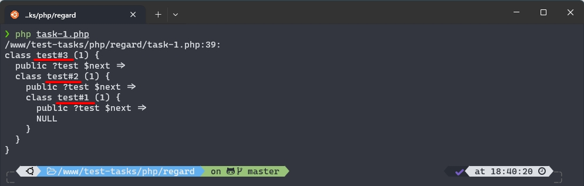
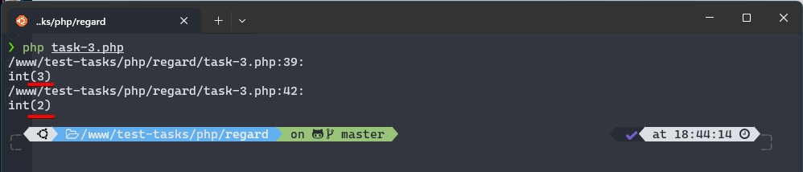

# Регард - Тестовые задачи на PHP

В этом репозитории находятся решения трех тестовых задач на PHP. В каждой задаче представлены комментарии, объясняющие логику выполнения, а также способы взаимодействия с классами и функциями.

## Задача 1: Разворот списка

- **Файл**: [Задача 1](./task-1.php)
- **Описание**: Напишите функцию, которая развернёт список. Последний элемент должен стать первым, а первый - последним.
- **Решение**:
    - Создан класс `test`, который представляет элемент списка.
    - Реализована функция `reverse()`, которая принимает элемент списка и разворачивает его, изменяя ссылки между элементами.
    - Код содержит комментарии, объясняющие каждый шаг процесса.

## Задача 2: Заказы и менеджеры

- **Файл**: [Задача 2](./task-2.php)
- **Описание**: Даны две модели `Order` и `Manager`. Каждый `Order` имеет `manager_id`. Необходимо вывести 50 заказов (Order) + fullName менеджера с минимальным кол-вом запросов к БД без использования join.
- **Решение**:
    - Созданы классы `Manager` и `Order`, где `Order` имеет связь с `Manager`.
    - В классе `Order` реализован статический метод `getOrdersWithManagers()`, который загружает заказы вместе с менеджерами, формируя массив с результатами.
    - Код содержит комментарии, описывающие работу каждого метода и логики.

## Задача 3: Максимальное количество рейсов

- **Файл**: [Задача 3](./task-3.php)
- **Описание**: Даны веса посылок `$boxes` и вес, который может увезти курьер `$weight`. Необходимо найти максимальное количество рейсов, которые курьер сможет сделать с учетом условий.
- **Решение**:
    - Реализована функция `getResult()`, которая принимает массив весов и целевой вес.
    - Функция подсчитывает количество возможных пар, чьи веса в сумме равны заданному значению, корректно обрабатывая условия.
    - Код содержит комментарии, которые объясняют каждый шаг и логику решения.

